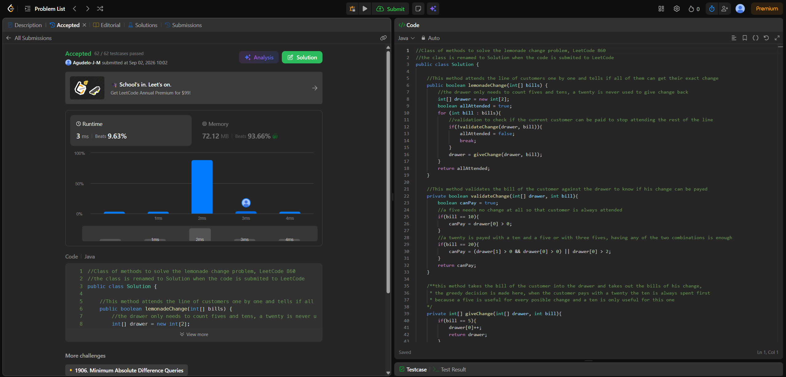
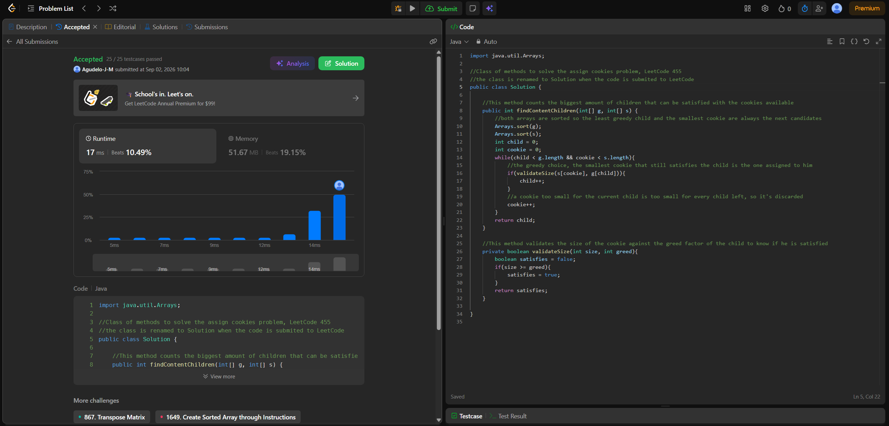

# Tarea 1. Algoritmos greedy en LeetCode

Código en 'src/LemonadeChange.java' (ejercicio 1), 'AssignCookies.java' (ejercicio 2) y
'App.java', que corre los casos de ejemplo de los dos problemas.

## 860. Lemonade Change

Enlace: https://leetcode.com/problems/lemonade-change/ Código: `src/LemonadeChange.java`

Criterio greedy: en cada cliente se da el vuelto con la combinación que menos compromete los
billetes de 5. Un billete de 20 se paga con `10 + 5` y no con `5 + 5 + 5`, porque el 5 sirve para el
vuelto de un 10 y también para las dos combinaciones del 20, mientras que el 10 solo sirve para un
20. Si no hay ninguna combinación posible, se devuelve `false`.

Complejidad: tiempo **O(n)**, espacio **O(1)**.

## 455. Assign Cookies

Enlace: https://leetcode.com/problems/assign-cookies/ Código: 'src/AssignCookies.java'

Criterio greedy: se ordenan 'g' y 's', y a cada niño se le asigna la galleta más pequeña que todavía
lo satisface. Una galleta que no le alcanza al niño menos exigente que queda no le alcanza a ninguno
de los siguientes, así que se descarta; y gastar una galleta grande en un niño fácil de contentar
solo le quita la pieza a uno más exigente.

Complejidad: tiempo **O(n log n + m log m)** por el ordenamiento, espacio **O(1)** adicional.

