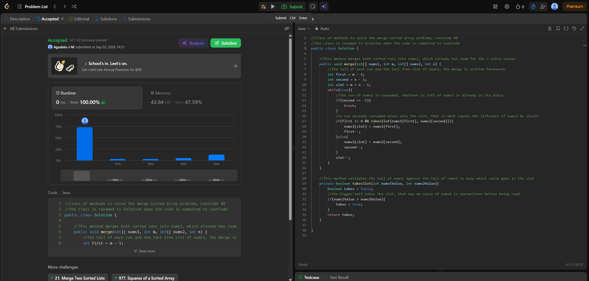
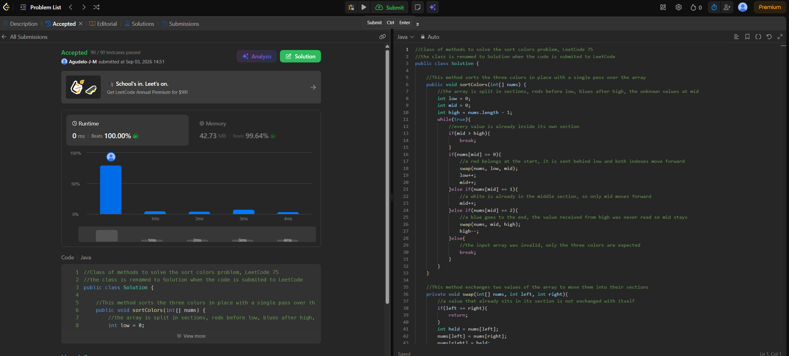

# Tarea 2. Algoritmos de ordenamiento en LeetCode

Código en `src/MergeSortedArray.java` (ejercicio 1), `src/SortColors.java` (ejercicio 2) y
`src/App.java`, que corre los casos de ejemplo de los dos problemas. En LeetCode las clases se
renombran a `Solution`, como se ve en las capturas.

## 88. Merge Sorted Array

Enlace: https://leetcode.com/problems/merge-sorted-array/ Código: `src/MergeSortedArray.java`

Algoritmo: fusión de dos corridas ya ordenadas, escrita desde el final. Se llevan tres índices, la
cola de cada corrida y el último hueco de `nums1`, y en cada paso la cola mayor toma el hueco. Se
escribe hacia atrás porque el espacio libre de `nums1` está al final: al fusionar desde el índice `0`
se pisarían valores de `nums1` que todavía no se han leído, mientras que hacia atrás cada posición
que se toca es relleno vacío o un valor ya consumido. El ciclo termina cuando se agota `nums2`,
porque lo que quede de `nums1` ya está ordenado y en su lugar; si en cambio se agota la corrida de
`nums1`, la guarda `first >= 0` falla siempre y las sobras de `nums2` se copian solas.

No se usa un sort comparativo porque las dos entradas **ya vienen ordenadas**. Concatenar y ordenar
tira esa información y cuesta **O((m+n) log(m+n))**; la fusión la aprovecha y cada comparación deja
un valor colocado de forma definitiva, sin volver a mirarlo.

Complejidad: tiempo **O(m + n)**, porque cada iteración llena un hueco y hay `m + n` huecos; espacio
**O(1)** adicional, solo los tres índices. Es lo que pide el follow-up.

Resultado del Submit: Accepted, 63 / 63 casos de prueba, 0 ms (Beats 100.00%) y 43.84 MB de memoria.

## 75. Sort Colors

Enlace: https://leetcode.com/problems/sort-colors/ Código: `src/SortColors.java`

Algoritmo: tres punteros (bandera holandesa) en **una sola pasada**, la opción del follow-up y no la
de counting de dos pasadas. `low`, `mid` y `high` parten el arreglo en cuatro tramos: los rojos antes
de `low`, los blancos entre `low` y `mid`, los valores sin revisar entre `mid` y `high`, y los azules
después de `high`. Un rojo se manda detrás de `low` y los dos índices avanzan; un blanco ya está en
su tramo y solo avanza `mid`; un azul se manda al final y `high` retrocede. El detalle que sostiene
todo es que **`mid` no avanza al colocar un azul**: el valor que llega desde `high` nunca se leyó, así
que hay que revisarlo en la siguiente iteración. El ciclo termina cuando el tramo sin revisar se
vacía, o sea cuando `mid > high`.

No se usa un sort comparativo por dos razones: el enunciado lo prohíbe, y el universo de claves es
diminuto y conocido de antemano, `k = 3`. Esto **no viola** la cota `Ω(n log n)` porque esa cota es un
teorema sobre el *modelo de comparaciones*: si lo único que se puede preguntar es «¿es `a[i] < a[j]`?»,
el árbol de decisión necesita `n!` hojas y su altura es `Ω(n log n)`. Aquí nunca se hace esa pregunta.
Se compara cada valor contra una **constante** (`nums[mid] == 0`, `== 1`, `== 2`), es decir se usa la
clave como etiqueta de tramo y no se comparan dos elementos entre sí, así que el algoritmo queda
fuera del modelo donde la cota está demostrada. El precio es que solo funciona porque `k` es chico y
se conoce antes de empezar: con enteros arbitrarios no habría contra qué ramificar.

Complejidad: tiempo **O(n + k)** con `k = 3` constante, o sea **O(n)**, porque cada iteración avanza
`mid` o retrocede `high` y la distancia entre ambos solo se reduce; espacio **O(1)**, los tres índices.

Resultado del Submit: Accepted, 90 / 90 casos de prueba, 0 ms (Beats 100.00%) y 42.73 MB (Beats 99.64%).

